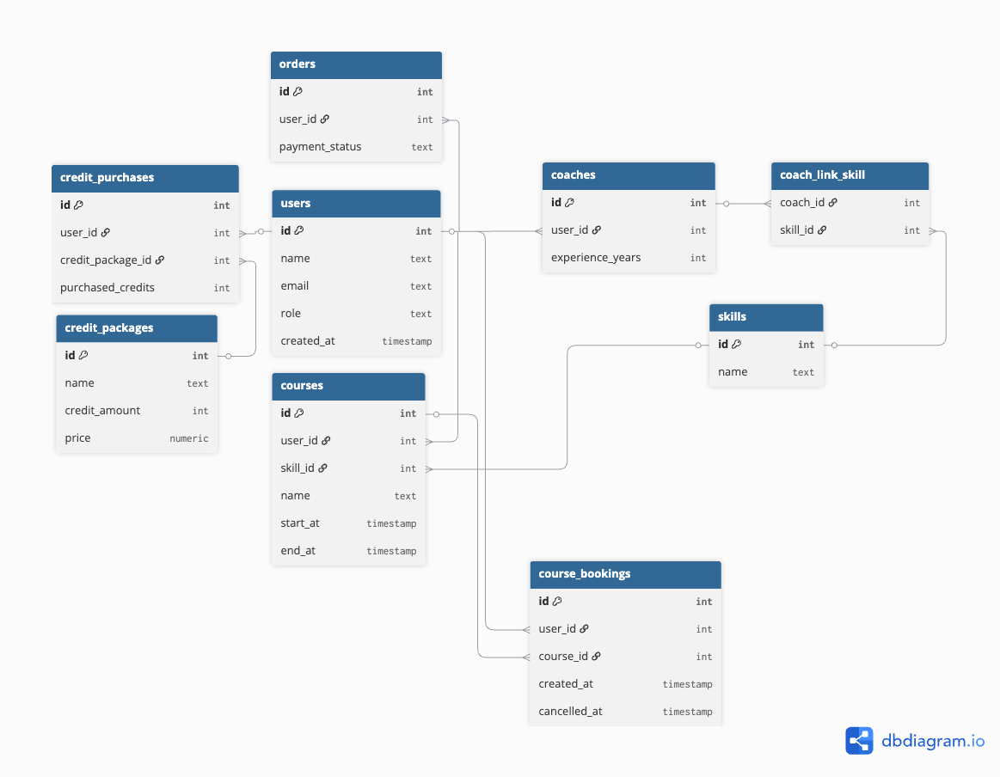
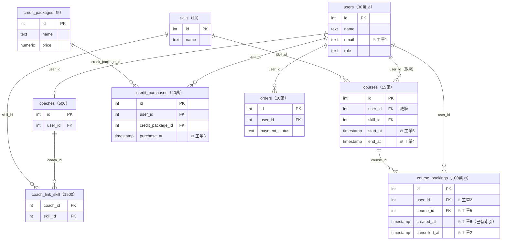

# LiveFit 資料表地圖

```mermaid
erDiagram
    users["users（30萬 🔥）"] {
        int id PK
        text name
        text email "🔥 工單1"
        text role
    }
    coaches["coaches（500）"] {
        int id PK
        int user_id FK
    }
    skills["skills（10）"] {
        int id PK
        text name
    }
    coach_link_skill["coach_link_skill（1500）"] {
        int coach_id FK
        int skill_id FK
    }
    courses["courses（15萬）"] {
        int id PK
        int user_id FK "教練"
        int skill_id FK
        timestamp start_at "🔥 工單5"
        timestamp end_at "🔥 工單4"
    }
    course_bookings["course_bookings（100萬 🔥）"] {
        int id PK
        int user_id FK "🔥 工單2"
        int course_id FK "🔥 工單5"
        timestamp created_at "🔥 工單6（已有索引）"
        timestamp cancelled_at "🔥 工單2"
    }
    credit_packages["credit_packages（5）"] {
        int id PK
        text name
        numeric price
    }
    credit_purchases["credit_purchases（40萬）"] {
        int id PK
        int user_id FK
        int credit_package_id FK
        timestamp purchase_at "🔥 工單3"
    }
    orders["orders（10萬）"] {
        int id PK
        int user_id FK
        text payment_status
    }

    users ||--o| coaches : "user_id"
    coaches ||--o{ coach_link_skill : "coach_id"
    skills ||--o{ coach_link_skill : "skill_id"
    users ||--o{ courses : "user_id（教練）"
    skills ||--o{ courses : "skill_id"
    users ||--o{ course_bookings : "user_id"
    courses ||--o{ course_bookings : "course_id"
    users ||--o{ credit_purchases : "user_id"
    credit_packages ||--o{ credit_purchases : "credit_package_id"
    users ||--o{ orders : "user_id"
```
